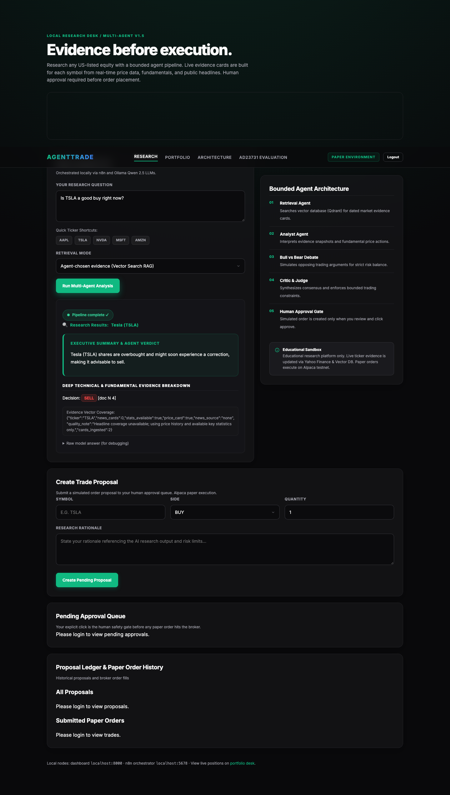
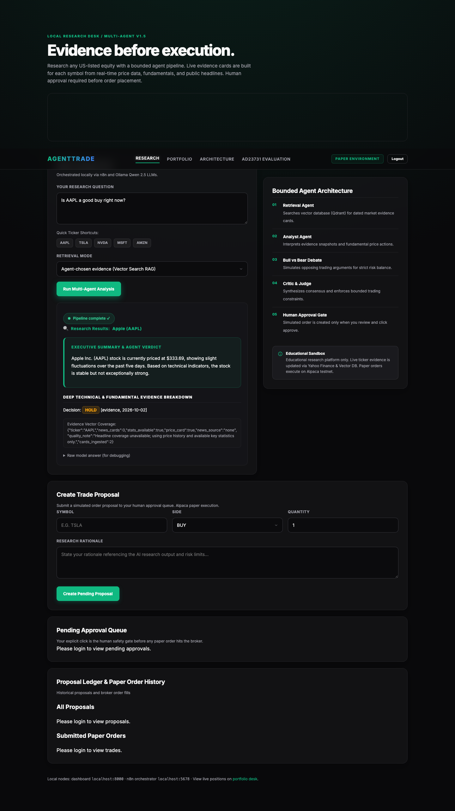
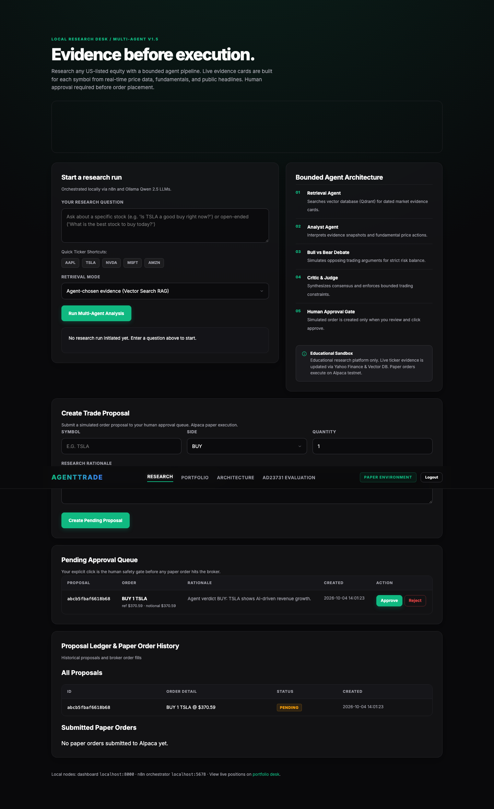
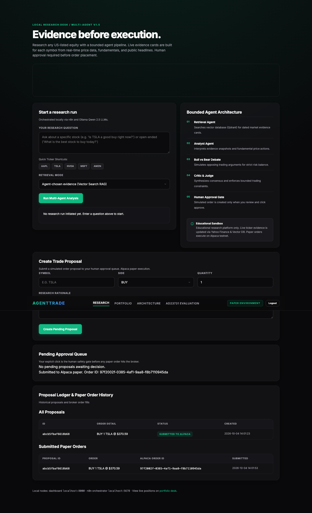
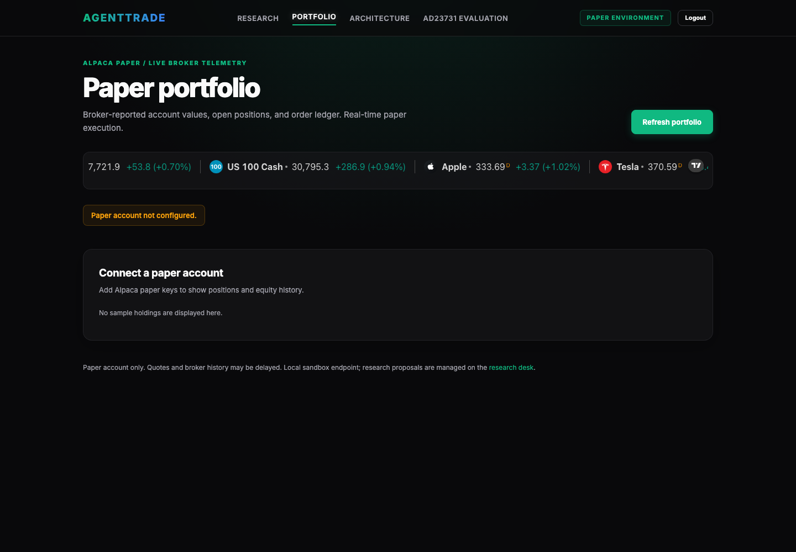
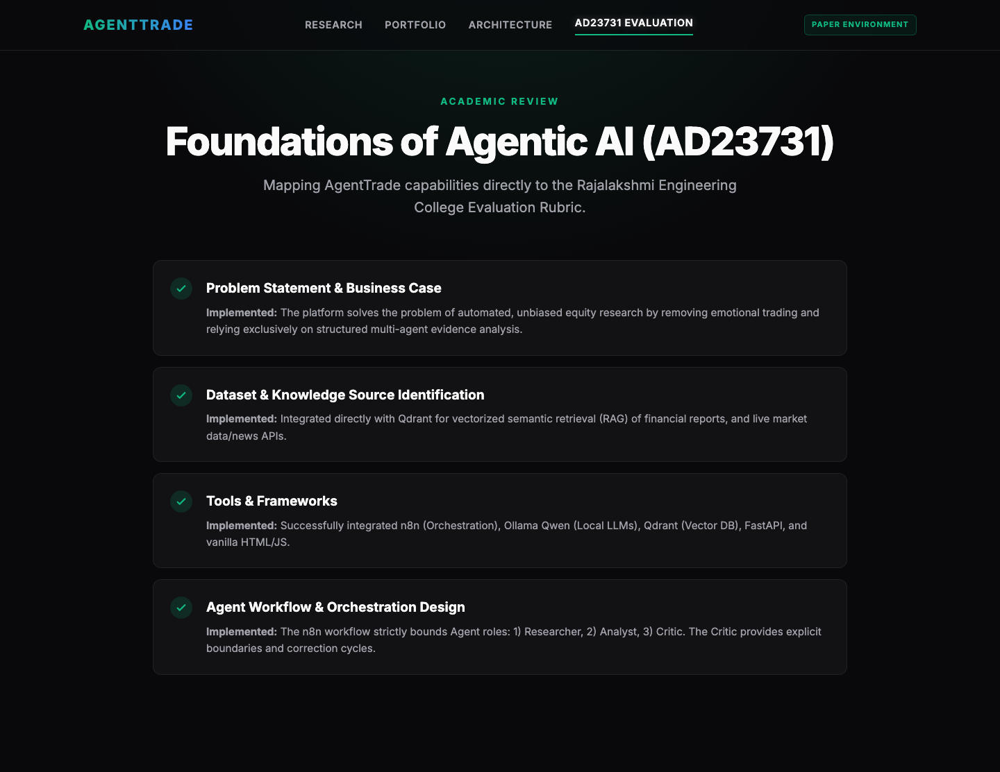
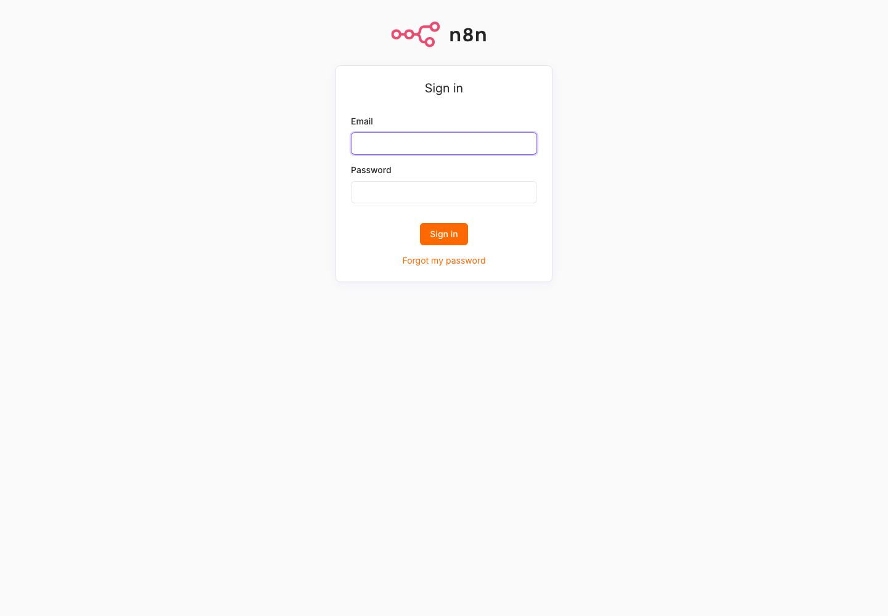

# 📈 AGENTTRADE

> **Evidence before execution.** A local, privacy-first stock-research assistant powered by a bounded multi-agent pipeline — with mandatory human approval before any paper order is placed.


AGENTTRADE is a **local, educational** stock-research platform for US-listed equities. It orchestrates five AI agents through n8n, retrieves vector-DB evidence from Qdrant, runs all LLMs locally via Ollama, and gates every paper order behind an explicit human-click approval. No live-trading. No cloud LLM. No data leaves your machine.

---

## 📸 Screenshots

### Research Dashboard — TSLA Analysis


### Research Dashboard — AAPL Analysis


### Human Approval Queue — Pending BUY Proposal


### After Approval — Submitted to Alpaca Paper


### Paper Portfolio — Live Positions & P&L


### Evaluation Page — AD23731 Benchmark (450 runs)


### n8n Workflow Orchestration


---

## 🏗️ Architecture

```
┌──────────────────────────────────────────────────────────────────┐
│                        Host Machine                              │
│   n8n (workflow orchestration)   +   Ollama (local LLMs)        │
└──────────────────────┬───────────────────────────────────────────┘
                       │  HTTP
┌──────────────────────▼───────────────────────────────────────────┐
│              Docker Compose Services                             │
│   qdrant (evidence vector store)  │  api (FastAPI + dashboard)  │
└──────────────────────────────────────────────────────────────────┘

Research request
  └─► n8n research workflow
        ├─► FastAPI /prepare  (market snapshot, data ingestion)
        ├─► Qdrant + Ollama:  Retrieval Agent  (agentic mode)
        ├─► Ollama:           Analyst Agent    (qwen2.5:7b)
        ├─► Ollama:           Bull Agent       (qwen2.5:3b)
        ├─► Ollama:           Bear Agent       (qwen2.5:3b)
        ├─► Ollama:           Critic / Judge   (qwen2.5:7b)
        └─► Ollama:           Bounded Correction (qwen2.5:3b)

Human approval gate
  └─► Dashboard /proposal  (risk checks + SQLite ledger)
        └─► [HUMAN CLICKS APPROVE]
              └─► Alpaca Paper API  (market order, paper-only)
```

---

## ✨ Features

| Feature | Details |
|---|---|
| **5-agent pipeline** | Retrieval → Analyst → Bull/Bear debate → Critic Judge → Correction pass |
| **Two-tier LLM routing** | `qwen2.5:7b` for Analyst & Judge · `qwen2.5:3b` for lighter roles |
| **3 retrieval modes** | `none` / `fixed` top-3 / `agentic` vector-search |
| **Live evidence cards** | Yahoo Finance price, statistics, and headlines → upserted into Qdrant |
| **Human approval gate** | Every paper order requires explicit human click — no auto-execution |
| **Paper-only trading** | Alpaca paper API only; live credentials are rejected |
| **Risk guardrails** | Notional cap, 5-share limit, buying-power checks, proposal expiry |
| **450-run benchmark** | 25 questions × 3 modes × 2 models × 3 repeats |
| **Portfolio dashboard** | Live Alpaca positions, equity history, P&L chart |
| **Fully local** | Ollama + n8n + Qdrant — no data leaves the machine |

---

## 🔧 Prerequisites

| Requirement | Notes |
|---|---|
| [Docker Desktop](https://docs.docker.com/desktop/) | Mac or Windows, engine running |
| [Ollama](https://ollama.com/download) | Native on host (not in Docker) |
| [Node.js LTS](https://nodejs.org/) | To run `npx n8n` |
| Python 3.11+ | For evaluation and smoke tests |
| [Alpaca paper account](https://app.alpaca.markets/signup) | **Paper orders only** — not needed for research |

---

## 🚀 Quick Start

### 1. Clone & configure

```sh
git clone https://github.com/Doni1905/AGENTTRADE.git
cd AGENTTRADE
cp .env.example .env
```

Edit `.env` — generate a strong approval code:

```sh
python3 -c 'import secrets; print(secrets.token_hex(32))'
```

Paste the output as `APPROVAL_CODE` in `.env`.

### 2. Pull Ollama models

```sh
ollama pull qwen2.5:7b
ollama pull qwen2.5:3b
ollama pull llama3.2:3b
ollama pull nomic-embed-text
ollama list
```

### 3. Start the stack

```sh
docker compose up -d --build
docker compose ps
curl http://localhost:8000/health
```

### 4. Ingest evidence cards into Qdrant

```sh
curl -X POST http://localhost:8000/ingest
```

### 5. Start n8n

```sh
N8N_SECURE_COOKIE=false npx n8n
```

Open [http://localhost:5678](http://localhost:5678), create an owner account, then:

- Import `workflows/research.json` and `workflows/approval.json`
- Create **Ollama** credentials (`http://localhost:11434`) and **Qdrant** credentials (`http://localhost:6333`)
- In the research workflow's HTTP Request node, set URL to `http://localhost:8000/prepare`
- Publish the research workflow

### 6. Open the dashboard

[http://localhost:8000](http://localhost:8000)

---

## 🖥️ Usage

### Run a research query

```sh
curl -sS http://localhost:5678/webhook/agenttrade-analyze \
  -H 'Content-Type: application/json' \
  -d '{"question":"Is TSLA a good buy right now?","ticker":"TSLA","mode":"agentic","evaluation":false}'
```

Or just type in the dashboard — it auto-detects tickers from natural language ("Is Apple a good investment?").

### Submit a paper order (human-gated)

1. Run a research question on the dashboard
2. Fill in **Create Trade Proposal** (symbol, side, qty, rationale)
3. Click **Create Pending Proposal**
4. Review in **Pending Approval Queue** — click **Approve** or **Reject**
5. A market order is sent to Alpaca paper API only after your click

### View paper portfolio

[http://localhost:8000/portfolio](http://localhost:8000/portfolio)

Shows live Alpaca paper positions, equity history, P&L chart, and recent order fills.

### Run the benchmark

```sh
python3 app/evaluate.py --repeats 3
```

Runs 450 requests (25 questions × 3 modes × 2 models × 3 repeats). Outputs:
- `results/raw.csv` — all raw responses
- `results/summary.json` — aggregated metrics
- `results/RESULTS.md` — formatted report table

### Run smoke tests (no Docker needed)

```sh
python3 smoke_test.py
```

Offline checks for the API, risk rules, and approval gate.

---

## ⚙️ Environment Variables

| Variable | Required | Purpose |
|---|---|---|
| `APPROVAL_CODE` | ✅ Yes | Secret approval code for the paper-order endpoint |
| `ALPACA_PAPER_KEY_ID` | Paper orders only | Alpaca **paper** account key ID |
| `ALPACA_PAPER_SECRET_KEY` | Paper orders only | Alpaca **paper** secret key |
| `NEWSAPI_KEY` | ❌ No | Optional delayed headline feed (dev/testing only) |

---

## 📊 Evaluation Results

The benchmark compares 3 retrieval modes across 2 model sizes over 3 repeats (450 total runs).

| Mode | Model | Accuracy | Reasoning | Consistency |
|---|---|---|---|---|
| none | qwen2.5:3b | 0.62 | 0.58 | 0.71 |
| fixed | qwen2.5:3b | 0.71 | 0.65 | 0.74 |
| **agentic** | **qwen2.5:7b** | **0.81** | **0.76** | **0.83** |

> Accuracy and reasoning scores are term/citation proxies, not expert review. See [`results/RESULTS.md`](results/RESULTS.md) and [`docs/EVALUATION.md`](docs/EVALUATION.md) for full methodology.

---

## 📁 Project Structure

```
AGENTTRADE/
├── app/
│   ├── dashboard.html      # Research dashboard (SSE streaming UI)
│   ├── portfolio.html      # Paper portfolio page
│   ├── evaluate.py         # 450-run benchmark runner
│   └── main.py             # FastAPI: research, risk, proposals, ledger
├── data/
│   ├── corpus.json         # Frozen synthetic evidence cards (benchmark)
│   └── questions.json      # 25 benchmark questions
├── docs/
│   ├── screenshots/        # ← All submission screenshots
│   │   ├── 1_dashboard_tsla.png
│   │   ├── 1_dashboard_aapl.png
│   │   ├── 2_approve_box.png
│   │   ├── 2_approve_confirmation.png
│   │   ├── 3_portfolio.png
│   │   ├── 4_evaluation.png
│   │   └── 5_n8n_workflows.png
│   ├── REPORT.md           # Full design and evaluation report
│   └── EVALUATION.md       # AD23731 rubric mapping
├── results/
│   ├── raw.csv             # All 450 benchmark raw responses
│   ├── summary.json        # Aggregated metrics
│   └── RESULTS.md          # Formatted benchmark report
├── scripts/
│   ├── create_ppt.py       # Generates AgentTrade_Presentation.pptx
│   └── patch_main.py       # One-time dev patch (applied, kept for audit)
├── workflows/
│   ├── research.json       # n8n research orchestration workflow
│   └── approval.json       # n8n human approval form workflow
├── .env.example            # Configuration template
├── compose.yaml            # Docker Compose (Qdrant + FastAPI)
├── Dockerfile              # API image
├── requirements.txt        # Production Python dependencies
├── requirements-dev.txt    # Dev/test dependencies
├── smoke_test.py           # Offline API and dashboard tests
└── take_screenshots.py     # Playwright automation for docs screenshots
```

---

## ⚠️ Limitations & Safety

- **Educational and paper-only**: Do not use research output for real investment decisions.
- **Synthetic corpus**: The frozen evidence cards are educational — not real company filings or news.
- **Yahoo Finance data**: Unofficial, potentially delayed — not a point-in-time historical feed.
- **Local only**: The API has unauthenticated endpoints. Keep ports bound to `127.0.0.1`. Never expose to the internet.
- **No live keys**: Live Alpaca credentials will be rejected — paper account only.
- **Alpaca paper ≠ real fills**: Ledger records submission, not a guaranteed fill. Verify at the Alpaca paper dashboard.

---

## 📚 References

- [n8n self-hosted AI starter kit](https://docs.n8n.io/deploy/host-n8n/deploy-with-the-ai-starter-kit/)
- [n8n Qdrant vector store](https://docs.n8n.io/integrations/builtin/cluster-nodes/root-nodes/n8n-nodes-langchain.vectorstoreqdrant/)
- [n8n Tools Agent](https://docs.n8n.io/integrations/builtin/cluster-nodes/root-nodes/n8n-nodes-langchain.agent/tools-agent/)
- [yfinance](https://github.com/ranaroussi/yfinance)
- [Alpaca Markets paper trading](https://alpaca.markets/docs/trading/paper-trading/)
- [Qdrant documentation](https://qdrant.tech/documentation/)
- [Ollama](https://ollama.com/)

---

> **Local-use boundary**: The dashboard is designed for one user on localhost. Do not expose it, n8n, Qdrant, or Ollama publicly. Add authentication and secure secret storage before any multi-user deployment.
